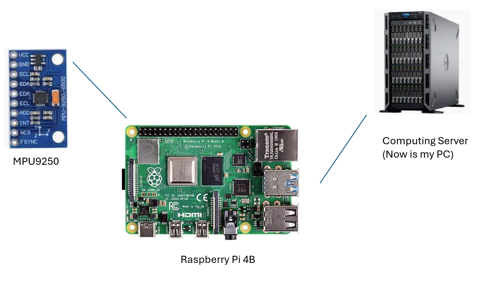
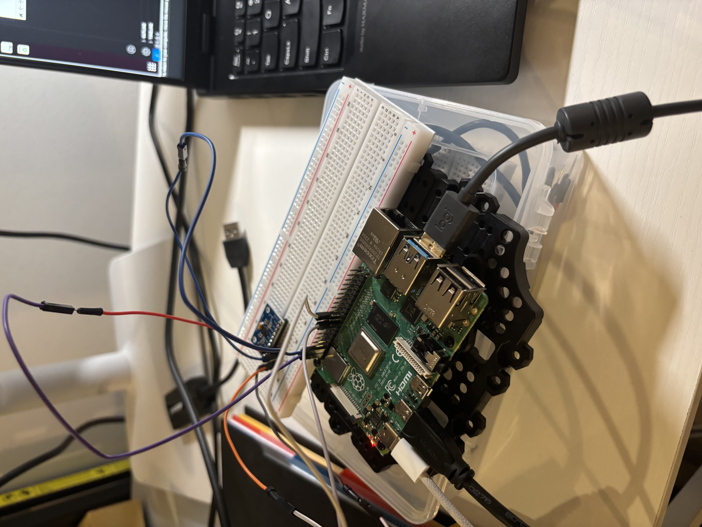
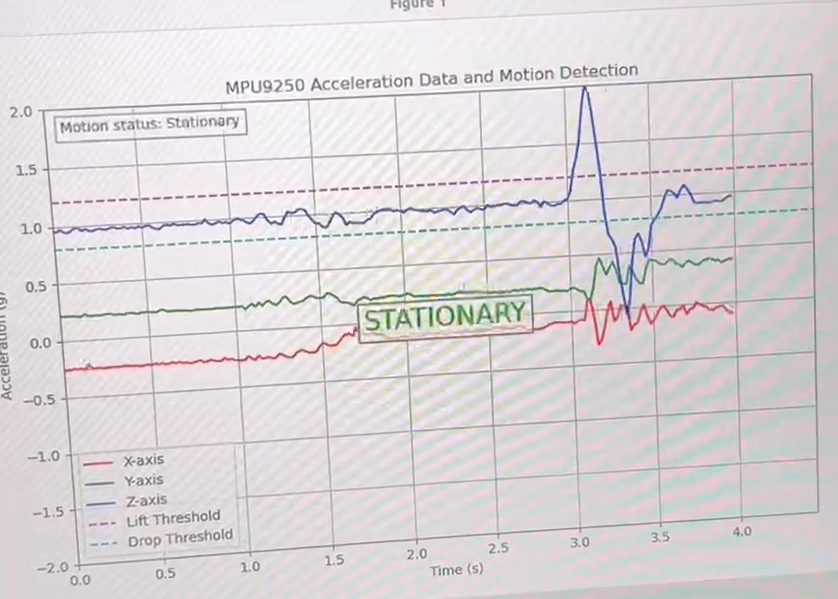
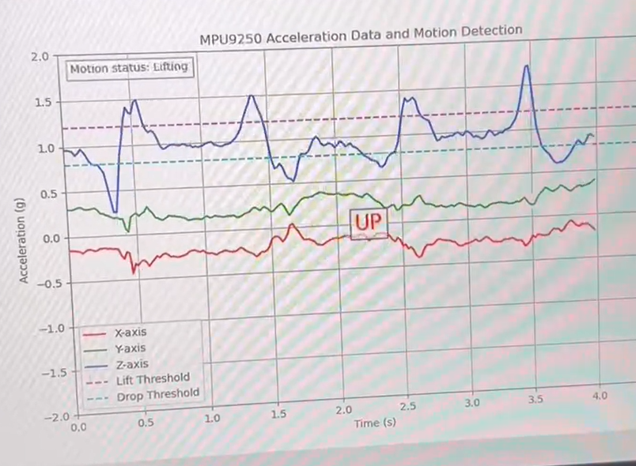

# SmartGlove

This project aims to design a smart glove that can ultimately recognize sign language and provide real-time translation.

This is a project in collaboration with [Qian Li](https://www.qianliportfolio.com/project2), a UX Designer and Researcher.

## Prototype and Gesture Recognition

In the first phase, this project will complete a smart glove that can recognize gestures.

The project adopts a ROS architecture, with Ubuntu 22.04 and ROS Humble installed on both Raspberry Pi 4B and PC (virtual machine) to facilitate future expansion and implementation of complex functions.

The configuration structure is as follows:

The physical prototype looks like this:

The code deployed on the Raspberry Pi 4B is stored separately in the following repository:

https://github.com/jeffliulab/SmartGlove_GloveSide

### Recognize the gestures

Using gravity detection from the MPU9250, we've implemented UP and DOWN detection:

 