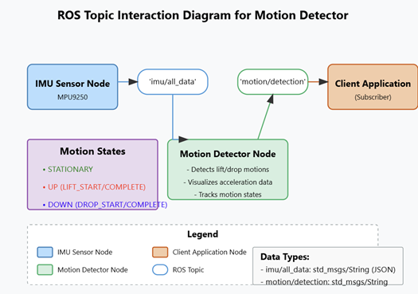
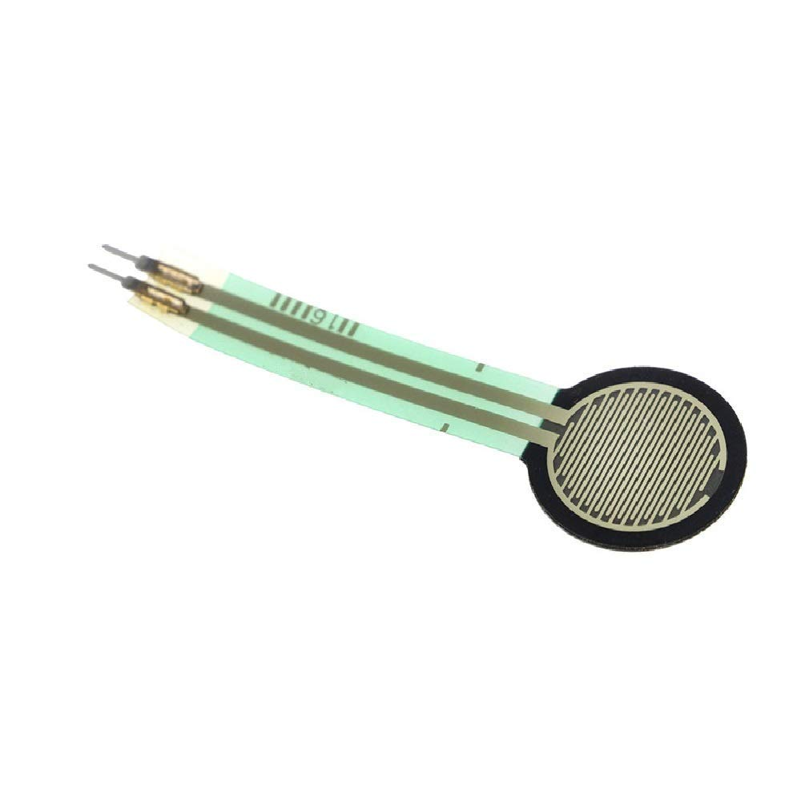

# SmartGlove

This project aims to design a smart glove that can do many things, includes recognize gestures, real-to-sim in virtual environment, control devices, etc.

In first stage, the project will collabrate with other teams to explore the potential and capbalities, all together aim to build an universal smart glove.
- Collaborate with [Qian Li](https://www.qianliportfolio.com/project2), on Sign Language Recognition.
- Collaborate with project team at Brandeis Robotics Lab, on [IoT platform](https://github.com/aiberk/embedded-systems-platform).

## Prototype

In the first phase, this project will complete a smart glove that can recognize gestures.

The project adopts a ROS architecture, with Ubuntu 22.04 and ROS Humble installed on both Raspberry Pi 4B and PC (virtual machine) to facilitate future expansion and implementation of complex functions.

The configuration structure is as follows:

- [Demo Video](https://youtube.com/shorts/qYl0_Sqa9_Q?si=NIhDoCjUwTQr8ySr)


The ROS framework is:



The physical prototype looks like this:


The code deployed on the Raspberry Pi 4B is stored separately in the following repository:

https://github.com/jeffliulab/SmartGlove_GloveSide

The wiring diagram is shown below:

- Pico W
```
(Pin 36) 3V3(OUT) ---- [ FSR402 ] ----+---- (Pin 31) GPIO26 (ADC0)
                                      |
                              [ 10kΩ Resistor ]
                                      |
                                  (Pin 38) GND
```

- Raspberry Pi 4b
```
PICO W: USB-A
Power: USB-C
MPU9250:    VCC
            GND
            SCL
            SDA

```

### Recognize the gestures

Using gravity detection from the MPU9250, we've implemented UP and DOWN detection:

 

### Recgnize the press

Using force sensor from FSR402:



FSR402 output analogue data, so the main.py is uploaded into PICO W:

```python
import serial

ser = serial.Serial('/dev/ttyACM0', 115200, timeout=1)
while True:
    line = ser.readline().decode('utf-8').strip()
    if line:
        print(line)
```

On Raspberry Pi 4b, use serial to read the data.